*正在请求专家建议，优化解决方案，该过程耗时可能较长，请耐心等待...*

# 数据清洗与语义增强流水线 - 重构设计方案（修订版）

---

## 目录

1. [执行摘要](#一、执行摘要)
2. [系统概述与目标](#二、系统概述与目标)
3. [项目结构](#三、项目结构)
4. [架构设计](#四、架构设计)
5. [核心模块详细设计](#五、核心模块详细设计)
6. [数据流转与命名规范](#六、数据流转与命名规范)
7. [设计模式应用](#七、设计模式应用)
8. [生产环境保障](#八、生产环境保障)
9. [测试策略](#九、测试策略)
10. [向后兼容策略](#十、向后兼容策略)
11. [分阶段实施路线](#十一、分阶段实施路线)
12. [附录](#十二、附录)

---

## 一、执行摘要

### 1.1 项目背景

本项目是一个**对话数据清洗与语义增强流水线**，负责将原始多轮对话数据转换为高质量的模型训练数据。当前代码存在**职责不清、代码重复、安全性不足、可扩展性差**等问题，需要进行架构重构。

### 1.2 重构目标

| 目标 | 描述 |
|------|------|
| **职责分离** | 将 God Object 拆分为单一职责模块 |
| **依赖倒置** | 通过接口解耦，提升可测试性和可替换性 |
| **可扩展性** | 支持新增增强器、分桶策略、清洗实现 |
| **健壮性** | 配置校验、原子写入、状态追踪、自定义异常 |
| **可追溯性** | 完整的数据血缘和运行元数据 |
| **生产就绪** | 多进程安全、流式处理、可观测性、标准打包 |

### 1.3 关键约束

| 约束 | 说明 |
|------|------|
| **保留现有结构** | `pipeline/` 目录直接放在项目根目录，不迁移到 `src/` |
| **兼容优先** | 重构采用"兼容层优先"策略，避免一次性删除导致导入雪崩 |
| **渐进式迁移** | 按阶段分批重构，每批只改动一个领域 |
| **删除空文件** | 删除 `__main__.py`、`legacy_compat.py` 等无意义文件 |
| **保留入口脚本** | `run_pipeline.py` 作为主要入口，保持不变 |

---

## 二、系统概述与目标

### 2.1 系统定位

本流水线是数据处理管线的核心组件，负责：

- 从原始对话数据中提取训练样本
- 通过 Data-Juicer 进行质量清洗
- 应用语义增强生成多样化训练数据
- 生成可追溯的质量报告

### 2.2 流水线步骤

| 步骤 | 名称 | 功能 | 并行 |
|------|------|------|------|
| 01 | split | 将多轮对话拆分为单轮样本 | 否 |
| 02 | bucket | 按轮次分桶 | 否 |
| 03 | clean_finalize | 清洗+过滤生成最终数据 | 是 |
| 04 | augment | 语义增强生成变体 | 是 |
| 05 | replace_text | 文本替换后处理 | 否 |

---

## 三、项目结构

### 3.1 目标目录结构

```
DataCleaning_Augmentation_Rebuild/
├── pipeline/
│   ├── __init__.py                          # 包入口，导出核心类
│   ├── core/                                # 核心调度（保留并修改）
│   │   ├── __init__.py
│   │   ├── pipeline.py                      # Pipeline 主类（修改）
│   │   ├── step.py                          # PipelineStep 基类（修改）
│   │   └── step_registry.py                 # 步骤注册表（修改）
│   ├── infrastructure/                      # 新增：基础设施层
│   │   ├── __init__.py
│   │   ├── config_manager.py                # 配置管理（Pydantic校验）
│   │   ├── path_resolver.py                 # 路径解析（统一占位符）
│   │   ├── state_tracker.py                 # 状态追踪（断点续跑）
│   │   ├── exceptions.py                    # 自定义异常体系
│   │   └── io/                              # I/O 抽象
│   │       ├── __init__.py
│   │       ├── reader.py                    # DataReader 接口
│   │       └── writer.py                    # DataWriter 接口（含原子写入）
│   ├── services/                            # 新增：领域服务层
│   │   ├── __init__.py
│   │   ├── augmentation/
│   │   │   ├── __init__.py
│   │   │   ├── service.py                   # AugmentationService
│   │   │   └── resource_loader.py           # 资源加载器（共享+释放）
│   │   └── data_cleaning/
│   │       ├── __init__.py
│   │       └── interface.py                 # DataCleaner 接口
│   ├── steps/                               # 步骤实现（保留并修改）
│   │   ├── __init__.py
│   │   ├── split.py                         # 01_split
│   │   ├── bucket.py                        # 02_bucket
│   │   ├── clean_finalize.py                # 03_clean_finalize（合并）
│   │   ├── augment.py                       # 04_augment
│   │   └── replace_text.py                  # 05_replace_text
│   ├── augmenters/                          # 增强器（保留并修改）
│   │   ├── __init__.py
│   │   ├── base.py
│   │   ├── composite.py
│   │   ├── categories.py
│   │   ├── registry.py
│   │   ├── utils.py
│   │   └── methods/
│   │       ├── lexical/
│   │       ├── model/
│   │       └── other/
│   ├── analyzers/                           # 分析器（保留）
│   ├── reporters/                           # 报告器（保留）
│   ├── schemas.py                           # 新增：Pydantic Schema 定义
│   └── utils/                               # 工具函数（保留并清理）
│       ├── __init__.py
│       ├── file_utils.py
│       ├── logger.py
│       ├── progress.py
│       └── subprocess_utils.py
├── configs/                                 # 配置文件（保留）
├── resources/                               # 资源文件（保留）
├── scripts/                                 # 入口脚本（保留）
│   ├── run_pipeline.py                      # 主要入口（保留）
│   └── ...                                  # 其他脚本（清理重复）
├── tests/                                   # 测试（保留并完善）
├── pyproject.toml                           # 新增：标准打包配置
├── .env.example                             # 新增：环境变量示例
├── .gitignore                               # 保留
└── README.md                                # 保留
```

### 3.2 删除的文件

| 文件 | 原因 |
|------|------|
| `pipeline/__main__.py` | 空文件，无任何作用 |
| `pipeline/legacy_compat.py` | 空文件，无任何作用 |
| `pipeline/common/` | 与 `augmenters/` 完全重复，冗余代码 |
| `scripts/common/` | 与 `pipeline/` 完全重复，冗余代码 |

---

## 四、架构设计

### 4.1 分层架构

```mermaid
flowchart TD
    subgraph 协调层 [Pipeline]
        Pipeline
    end
    
    subgraph 步骤编排层 [Steps]
        SplitStep
        BucketStep
        CleanFinalizeStep
        AugmentStep
        ReplaceTextStep
    end
    
    subgraph 领域服务层 [Services]
        AugmentationService
        DataCleaner
    end
    
    subgraph 领域接口层 [Interfaces]
        DataCleanerInterface
        BucketStrategyInterface
        AugmentationStrategyInterface
    end
    
    subgraph 基础设施层 [Infrastructure]
        ConfigManager
        PathResolver
        StateTracker
        DataReader
        DataWriter
        StepRegistry
        PipelineError
    end
    
    subgraph 可观测性层 [Observability]
        ReportContext
        MetricsCollector
    end
    
    Pipeline --> Steps
    Steps --> Services
    Services ..> Interfaces
    Steps --> Infrastructure
    
    Pipeline --> Observability
    Steps -.-> Observability  %% 横切关注点
```

### 4.2 类图（精简版）

```mermaid
classDiagram
    direction LR
    
    %% 协调层
    class Pipeline {
        -config_manager: ConfigManager
        -path_resolver: PathResolver
        -state_tracker: StateTracker
        -observability: Observability
        +run(step_name) bool
    }
    
    %% 基础设施层
    class ConfigManager {
        +load(config_path) PipelineConfig~Pydantic~
        +get_step_config(step_name) dict
    }
    
    class PathResolver {
        +resolve(path_str) Path
        +get_task_dir() Path
        +get_step_output_dir(step_name) Path
    }
    
    class StateTracker {
        +is_step_done(step_name) bool
        +mark_step_done(step_name)
        +clear_step_done(step_name)
    }
    
    class StepRegistry~Factory+Decorator~ {
        +register(name) decorator
        +get_step(name, context) PipelineStep
    }
    
    class DataReader~Interface~ {
        +read_json(path) list
        +read_jsonl(path) generator
        +read_jsonl_chunk(path, chunk_size) generator
    }
    
    class DataWriter~Interface~ {
        +write_json(data, path)
        +write_jsonl(data, path)
        +atomic_write_json(data, path)
        +atomic_write_jsonl(data, path)
    }
    
    class PipelineError~Exception~ {
        """所有流水线异常的基类"""
    }
    
    class SchemaValidationError~PipelineError~ {
        """Schema校验失败"""
    }
    
    %% 步骤基类
    class PipelineStep~ABC+TemplateMethod~ {
        +step_name: str
        +config_manager: ConfigManager
        +path_resolver: PathResolver
        +state_tracker: StateTracker
        +data_reader: DataReader
        +data_writer: DataWriter
        +report_context: ReportContext
        +run() bool*
        +pre_run() bool
        +post_run() bool
        +_validate_input(data, schema) ValidationResult
        +_validate_output(data, schema) ValidationResult
    }
    
    %% 服务层
    class AugmentationService {
        -config: AugmentationConfig~Pydantic~
        -resource_loader: ResourceLoader
        +enhance_dialogue(dialogue, rng) tuple
        +run_parallel(data, workers) tuple
    }
    
    class ResourceLoader {
        -_shared_resources: dict
        +preload(config) dict
        +inject_shared() dict
        +clear()
    }
    
    %% Schema
    class Dialogue~DTO~ {
        +messages: list[Message]
    }
    
    class Sample~DTO~ {
        +id: int
        +turn: int
        +user_input: str
        +target_output: str
        +loss: bool
        +text: str
    }
    
    class ValidationResult~DTO~ {
        +valid: bool
        +errors: list[str]
        +warnings: list[str]
    }
    
    %% 可观测性
    class Observability {
        +report_context: ReportContext
        +metrics_collector: MetricsCollector
        +finalize()
    }
    
    class ReportContext {
        +add_step_report(step_name, report)
        +finalize()
    }
    
    class MetricsCollector {
        +record(step_name, metric_name, value)
        +get_metrics() dict
    }
```



---

## 五、核心模块详细设计

### 5.1 Pipeline（生命周期管理）

```python
class Pipeline:
    def __init__(self, config_path: Path = None, config_dict: dict = None):
        self._config_manager = ConfigManager(config_path, config_dict)
        self._path_resolver = PathResolver(self._config_manager)
        self._state_tracker = StateTracker(self._path_resolver)
        self._observability = Observability()
    
    def run(self, step_name: str = None) -> bool:
        """执行流水线"""
        try:
            if step_name:
                return self._run_single(step_name)
            return self._run_all()
        finally:
            ResourceLoader.clear()
            self._observability.finalize()
    
    def _run_single(self, step_name: str) -> bool:
        """执行单个步骤（简化版，移除Executor间接层）"""
        if not self._state_tracker.is_step_enabled(step_name):
            return True
        
        if self._state_tracker.is_step_done(step_name):
            return True
        
        step = StepRegistry.get_step(step_name, self._build_step_context())
        
        if not step.pre_run():
            return True
        
        try:
            success = step.run()
        except Exception as e:
            self._observability.metrics_collector.record(step_name, "error", str(e))
            success = False
        
        if success:
            step.post_run()
            self._state_tracker.mark_step_done(step_name)
        
        return success
    
    def _build_step_context(self) -> dict:
        """构建步骤上下文（依赖注入）"""
        return {
            "config_manager": self._config_manager,
            "path_resolver": self._path_resolver,
            "state_tracker": self._state_tracker,
            "data_reader": DataReader(),
            "data_writer": DataWriter(),
            "report_context": self._observability.report_context,
        }
```

### 5.2 ConfigManager（配置管理）

```python
class ConfigManager:
    def __init__(self, config_path: Path = None, config_dict: dict = None):
        if config_path:
            self._config = self._load_from_file(config_path)
        elif config_dict:
            self._config = self._validate(config_dict)
        else:
            raise ValueError("必须提供 config_path 或 config_dict")
    
    def _load_from_file(self, config_path: Path) -> PipelineConfig:
        with open(config_path, "r", encoding="utf-8") as f:
            raw = yaml.safe_load(f)
        return self._validate(raw)
    
    def _validate(self, raw: dict) -> PipelineConfig:
        """使用 Pydantic 进行 Fail-fast 校验"""
        return PipelineConfig(**raw)
    
    def get_step_config(self, step_name: str) -> dict:
        return self._config.steps.get(step_name, {})
    
    def get_global_config(self) -> dict:
        return {
            "task_name": self._config.task_name,
            "resume": self._config.resume,
            "max_workers": self._config.executor.max_workers,
        }
```

### 5.3 PathResolver（路径解析）

```python
class PathResolver:
    def __init__(self, config_manager: ConfigManager):
        self._config_manager = config_manager
        self._task_name = config_manager.get_global_config()["task_name"]
        self._intermediate_root = Path(
            config_manager.get_global_config().get("paths", {}).get("intermediate", "./intermediate")
        )
        self._task_dir = self._intermediate_root / self._task_name
    
    def resolve(self, path_str: str) -> Path:
        """统一路径解析：支持绝对路径、{task_dir}占位符、相对路径"""
        p = Path(path_str)
        if p.is_absolute():
            return p
        if "{task_dir}" in path_str:
            return Path(path_str.format(task_dir=str(self._task_dir)))
        project_root = self._intermediate_root.parent
        return project_root / p
    
    def get_task_dir(self) -> Path:
        return self._task_dir
    
    def get_step_output_dir(self, step_name: str) -> Path:
        step_cfg = self._config_manager.get_step_config(step_name)
        out_dir = step_cfg.get("output_dir")
        if out_dir:
            return self.resolve(out_dir)
        return self._task_dir / step_name
```

### 5.4 PipelineStep（依赖注入 + Schema 校验）

```python
class PipelineStep(ABC):
    DEFAULT_VALIDATION_SAMPLE_SIZE = 10
    
    def __init__(self, context: dict):
        self.config_manager = context["config_manager"]
        self.path_resolver = context["path_resolver"]
        self.state_tracker = context["state_tracker"]
        self.data_reader = context["data_reader"]
        self.data_writer = context["data_writer"]
        self.report_context = context["report_context"]
        self.logger = logging.getLogger(f"Pipeline.{self.step_name}")
    
    @property
    @abstractmethod
    def step_name(self) -> str:
        pass
    
    @abstractmethod
    def run(self) -> bool:
        pass
    
    def pre_run(self) -> bool:
        """运行前准备：校验输入数据"""
        input_data = self._read_input()
        validation = self._validate_input(input_data, self._input_schema)
        if not validation.valid:
            raise SchemaValidationError(self.step_name, validation.errors)
        return True
    
    def post_run(self) -> bool:
        """运行后处理：校验输出数据、记录 IO"""
        output_data = self._get_output_data()
        validation = self._validate_output(output_data, self._output_schema)
        if not validation.valid:
            raise SchemaValidationError(self.step_name, validation.errors)
        
        self.report_context.add_step_report(self.step_name, {
            "input_paths": self._get_input_paths(),
            "output_paths": self._get_output_paths(),
            "statistics": self._get_statistics(),
        })
        return True
    
    def _validate_input(self, data: Any, schema) -> ValidationResult:
        return self._validate(data, schema, self.DEFAULT_VALIDATION_SAMPLE_SIZE)
    
    def _validate_output(self, data: Any, schema) -> ValidationResult:
        return self._validate(data, schema, self.DEFAULT_VALIDATION_SAMPLE_SIZE)
    
    def _validate(self, data: Any, schema, sample_size: int) -> ValidationResult:
        errors = []
        warnings = []
        
        if not data:
            return ValidationResult(valid=True, errors=[], warnings=["空数据"])
        
        sample = list(data)[:sample_size] if isinstance(data, (list, tuple)) else [data]
        
        for i, item in enumerate(sample):
            try:
                schema(**item)
            except Exception as e:
                errors.append(f"第{i}条数据校验失败: {str(e)}")
        
        return ValidationResult(valid=len(errors) == 0, errors=errors, warnings=warnings)
    
    def _read_input(self) -> Any:
        """子类重写，读取输入数据"""
        return []
    
    def _get_output_data(self) -> Any:
        """子类重写，获取输出数据"""
        return []
    
    def _get_input_paths(self) -> List[Path]:
        """子类重写，返回输入路径列表"""
        return []
    
    def _get_output_paths(self) -> List[Path]:
        """子类重写，返回输出路径列表"""
        return []
    
    def _get_statistics(self) -> dict:
        """子类重写，返回统计信息"""
        return {}
```

### 5.5 DataReader / DataWriter（I/O 抽象）

```python
class DataReader:
    @staticmethod
    def read_json(path: Path) -> list:
        with open(path, "r", encoding="utf-8") as f:
            return json.load(f)
    
    @staticmethod
    def read_jsonl(path: Path) -> generator:
        with open(path, "r", encoding="utf-8") as f:
            for line in f:
                line = line.strip()
                if line:
                    yield json.loads(line)
    
    @staticmethod
    def read_jsonl_chunk(path: Path, chunk_size: int) -> generator:
        chunk = []
        with open(path, "r", encoding="utf-8") as f:
            for line in f:
                line = line.strip()
                if line:
                    chunk.append(json.loads(line))
                    if len(chunk) >= chunk_size:
                        yield chunk
                        chunk = []
            if chunk:
                yield chunk


class DataWriter:
    @staticmethod
    def write_json(data: list, path: Path):
        path.parent.mkdir(parents=True, exist_ok=True)
        with open(path, "w", encoding="utf-8") as f:
            json.dump(data, f, ensure_ascii=False, indent=2)
    
    @staticmethod
    def write_jsonl(data: list, path: Path):
        path.parent.mkdir(parents=True, exist_ok=True)
        with open(path, "w", encoding="utf-8") as f:
            for item in data:
                f.write(json.dumps(item, ensure_ascii=False) + "\n")
    
    @staticmethod
    def atomic_write_json(data: list, path: Path):
        """原子写入：先写入临时文件，再重命名"""
        temp_path = path.with_suffix(".tmp")
        DataWriter.write_json(data, temp_path)
        temp_path.rename(path)
    
    @staticmethod
    def atomic_write_jsonl(data: list, path: Path):
        """原子写入：先写入临时文件，再重命名"""
        temp_path = path.with_suffix(".tmp")
        DataWriter.write_jsonl(data, temp_path)
        temp_path.rename(path)
```

### 5.6 AugmentationService（服务层拆分）

```python
class AugmentationService:
    def __init__(self, config: AugmentationConfig, shared_resources: dict = None):
        self._config = config
        self._shared_resources = shared_resources or {}
        self._composite = self._build_composite()
    
    def _build_composite(self) -> CompositeAugmenter:
        """构建组合增强器"""
        composite_config = {
            "augmenters": self._config.augmenters,
            "strategy": self._config.strategy,
            "default_steps": self._config.max_steps,
            "enabled_categories": self._config.enabled_categories,
            "single_retry": self._config.single_retry,
            "multi_retry": self._config.multi_retry,
        }
        composite = CompositeAugmenter(composite_config)
        
        if self._shared_resources:
            for aug in composite.augmenters:
                aug.config["shared_resources"] = self._shared_resources
        
        return composite
    
    def enhance_dialogue(self, dialogue: dict, rng: random.Random) -> tuple:
        """增强单个对话，返回 (变体列表, 元数据列表)"""
        messages = dialogue.get("messages", [])
        if not messages:
            return [], []
        
        enhanceable = self._get_enhanceable_indices(messages)
        if not enhanceable:
            return [], []
        
        num_variants = self._get_num_variants(enhanceable)
        
        variants = []
        variant_meta = []
        for _ in range(num_variants):
            try:
                new_dialogue = deepcopy(dialogue)
                new_messages = new_dialogue["messages"]
                changed = False
                
                for idx in enhanceable:
                    if rng.random() > self._config.message_augment_prob:
                        continue
                    
                    original_text = new_messages[idx].get("content", "")
                    if not original_text:
                        continue
                    
                    new_text = self._apply_text_to_content(original_text, rng)
                    if new_text != original_text:
                        new_messages[idx]["content"] = new_text
                        changed = True
                
                if changed:
                    variants.append(new_dialogue)
                    variant_meta.append(list(self._composite.enabled_names()))
            except Exception:
                continue
        
        return variants, variant_meta
    
    def run_parallel(self, data: list, max_workers: int) -> tuple:
        """并行增强，返回 (原始数据, 变体数据, 失败索引)"""
        chunk_size = max(1, (len(data) + max_workers - 1) // max_workers)
        chunks = [data[i:i+chunk_size] for i in range(0, len(data), chunk_size)]
        
        with ProcessPoolExecutor(max_workers=max_workers) as executor:
            futures = [
                executor.submit(self._process_chunk, chunk, seed + i * 1000)
                for i, chunk in enumerate(chunks)
            ]
            
            all_original = []
            all_variants = []
            failed = []
            
            for future in tqdm(as_completed(futures), total=len(futures)):
                orig, vars_list, fail_idx = future.result()
                all_original.extend(orig)
                all_variants.extend(vars_list)
                failed.extend(fail_idx)
            
            return all_original, all_variants, failed
    
    def _process_chunk(self, chunk: list, seed: int) -> tuple:
        """处理单个 chunk"""
        rng = random.Random(seed)
        original_list = []
        variants_list = []
        failed_indices = []
        
        for idx, dialogue in enumerate(chunk):
            original_list.append(dialogue)
            try:
                vars_out, _ = self.enhance_dialogue(dialogue, rng)
                variants_list.extend(vars_out)
            except Exception:
                failed_indices.append(idx)
        
        return original_list, variants_list, failed_indices
```

### 5.7 ResourceLoader（资源生命周期管理）

```python
class ResourceLoader:
    _shared_resources: Dict = {}  # 主进程全局共享（fork后COW）
    
    @classmethod
    def preload(cls, config: dict) -> Dict:
        """主进程预加载资源到全局共享变量"""
        if cls._shared_resources:
            return cls._shared_resources
        
        resources = {}
        if cls._needs_model(config):
            resources.update(cls._load_asr_resources(config))
        
        cls._shared_resources = resources
        return resources
    
    @classmethod
    def inject_shared(cls) -> Dict:
        """子进程注入共享资源（只读，fork后继承）"""
        return cls._shared_resources
    
    @classmethod
    def clear(cls):
        """释放共享资源（防止长期运行进程内存膨胀）"""
        cls._shared_resources.clear()
    
    @staticmethod
    def _needs_model(config: dict) -> bool:
        """判断是否需要加载模型"""
        augmenters_cfg = config.get("augmenters", {})
        enabled_cats = config.get("enabled_categories")
        
        for name, sub in augmenters_cfg.items():
            if sub.get("enabled", False) and requires_model(name):
                if enabled_cats is not None and CATEGORY_MODEL not in enabled_cats:
                    continue
                return True
        return False
    
    @staticmethod
    def _load_asr_resources(config: dict) -> Dict:
        """加载 ASR 噪声增强所需资源"""
        asr_cfg = config.get("augmenters", {}).get("asr_noise", {})
        if not asr_cfg.get("enabled", False):
            return {}
        
        try:
            from pipeline.augmenters.methods.model.asr_noise import AsrNoiseAugmenter
            
            preloader = AsrNoiseAugmenter(asr_cfg)
            preloader.initialize()
            
            return {
                "asr_noise.abnormal_words": preloader.abnormal_words,
                "asr_noise.abnormal_vectors": preloader.abnormal_vectors,
                "asr_noise.word_to_idx": preloader.word_to_idx,
                "asr_noise.pinyin_dict": preloader.pinyin_dict,
                "asr_noise.prev_to_abnormals": preloader.prev_to_abnormals,
                "asr_noise.config": {
                    "prob": preloader.prob,
                    "alpha": preloader.alpha,
                    "max_operations": preloader.max_operations,
                    "insert_prob": preloader.insert_prob,
                    "retry_times": preloader.retry_times,
                    "dim": preloader.dim,
                },
            }
        except Exception as e:
            logging.error(f"ASR 资源预加载失败: {e}")
            return {}
```

### 5.8 自定义异常体系

```python
class PipelineError(Exception):
    """所有流水线异常的基类"""
    pass


class SchemaValidationError(PipelineError):
    """Schema 校验失败"""
    def __init__(self, step_name: str, errors: list):
        super().__init__(f"步骤 {step_name} 数据校验失败")
        self.step_name = step_name
        self.errors = errors
    
    def __str__(self):
        return f"步骤 {self.step_name} 数据校验失败: {'; '.join(self.errors)}"


class ConfigError(PipelineError):
    """配置错误"""
    def __init__(self, message: str):
        super().__init__(message)


class FileNotFoundError(PipelineError):
    """文件不存在"""
    def __init__(self, path: Path):
        super().__init__(f"文件不存在: {path}")
        self.path = path


class StepExecutionError(PipelineError):
    """步骤执行错误"""
    def __init__(self, step_name: str, error: str):
        super().__init__(f"步骤 {step_name} 执行失败: {error}")
        self.step_name = step_name
        self.error = error
```

---

## 六、数据流转与命名规范

### 6.1 数据流转图

```mermaid
flowchart TD
    A[raw_dialogues.json] -->|01_split| B[samples/sample_*.jsonl]
    B -->|02_bucket| C[bucketed/bucket_*/]
    C -->|03_clean_finalize| D[cleaned/{task_name}_cleaned_{timestamp}/]
    C -->|03_clean_finalize| E[filter/{task_name}_filtered_{timestamp}/]
    E -->|04_augment| F[augmented/{task_name}_augmented_{method}_{mode}_{timestamp}/]
    F -->|05_replace_text| G[replace/{task_name}_replaced_{timestamp}/]
    
    E -->|生成| H[filter_report.json]
    F -->|生成| I[augment_stats.json]
    
    style A fill:#f9f,stroke:#333,stroke-width:2px
    style G fill:#ccf,stroke:#333,stroke-width:2px
```

### 6.2 命名规范

**文件名格式**：

```
{task_name}_{step}_{metadata}_{timestamp}.{ext}
```

**元数据存储**：每个输出目录下包含 `metadata.json`，记录完整元信息：

```json
{
  "task_name": "my_task",
  "step": "augment",
  "method": "asr+lexical",
  "mode": "adaptive",
  "timestamp": "20260722_153000",
  "version": "2.0"
}
```

---

## 七、设计模式应用

| 组件 | 解决的问题 | 设计模式 | 核心类 | 扩展点 |
|------|-----------|---------|---------|--------|
| **PipelineStep** | 统一步骤执行流程 | Template Method | `PipelineStep` | 子类重写 `run()` |
| **StepRegistry** | 动态注册和创建步骤 | Factory + Decorator | `StepRegistry` | `@register(name)` |
| **BucketStrategy** | 支持多种分桶策略 | Strategy | `BucketStrategy` | 新增策略实现 |
| **AugmentationStrategy** | 支持多种增强组合策略 | Strategy | `CompositeAugmenter` | 新增策略实现 |
| **DataCleaner** | 解耦清洗实现 | Dependency Inversion | `DataCleanerInterface` | 新增清洗器实现 |
| **DataReader/DataWriter** | 解耦文件操作 | Dependency Inversion | `DataReader`, `DataWriter` | 新增存储后端 |
| **ResourceLoader** | 多进程资源共享+释放 | Singleton + COW | `ResourceLoader` | 新增资源类型 |
| **PipelineError** | 统一异常体系 | Exception Hierarchy | `PipelineError` | 新增异常类型 |

---

## 八、生产环境保障

### 8.1 多进程资源共享

**方案**：ResourceLoader 通过 fork 的 Copy-on-Write 机制实现只读共享。

**释放机制**：`ResourceLoader.clear()` 在 Pipeline 的 `finally` 块中调用，确保每次运行后释放共享资源。

### 8.2 配置严格校验

**方案**：使用 Pydantic 模型进行 Fail-fast 校验。

### 8.3 原子写入

**方案**：DataWriter 接口内置原子写入方法（先写临时文件，再重命名）。

### 8.4 流式处理支持

**方案**：DataReader/DataWriter 支持流式和分块读写。

### 8.5 自定义异常体系

**方案**：定义 `PipelineError` 基类及子类异常，统一异常处理。

### 8.6 Schema 抽样校验

**方案**：每个 Step 在 `pre_run()` 和 `post_run()` 中对输入输出进行抽样校验（默认 10 条）。

---

## 九、测试策略

### 9.1 单元测试

**策略**：依赖注入 + Mock 隔离，不依赖真实文件/模型。

### 9.2 集成测试

**策略**：使用临时目录和固定种子数据。

### 9.3 Schema 校验测试

```python
def test_schema_validation_failure():
    """测试 Schema 校验失败时抛出 SchemaValidationError"""
    invalid_data = [
        {"messages": [{"role": "invalid_role", "content": "hello"}]},
        {"messages": []},
    ]
    
    step = SplitStep(...)
    with pytest.raises(SchemaValidationError) as exc_info:
        step._validate_input(invalid_data, Dialogue)
    
    assert exc_info.value.step_name == "01_split"
    assert len(exc_info.value.errors) == 2
```

### 9.4 资源释放测试

```python
def test_resource_loader_clear():
    """测试 ResourceLoader.clear() 释放资源"""
    ResourceLoader._shared_resources = {"model": "test"}
    
    ResourceLoader.clear()
    
    assert ResourceLoader._shared_resources == {}
```

---

## 十、向后兼容策略

### 10.1 兼容层优先

**策略**：重构时保留旧模块入口作为 thin wrapper 转发到新实现，逐步迁移调用点，最后再删除旧文件。

### 10.2 配置版本检测

**策略**：自动检测配置格式版本，支持旧格式自动迁移。

### 10.3 特性开关

**策略**：通过配置控制新功能启用，默认关闭新功能。

---

## 十一、分阶段实施路线

### Phase 1：基础设施层搭建（P0）

**目标**：构建 ConfigManager、PathResolver、StateTracker、DataReader/DataWriter、exceptions、schemas

**步骤**：

| 序号 | 任务 | 输出文件 | 状态 |
|------|------|----------|------|
| 1.1 | 创建自定义异常体系 | `pipeline/infrastructure/exceptions.py` | ✅ |
| 1.2 | 创建 Pydantic Schema 定义 | `pipeline/schemas.py` | ✅ |
| 1.3 | 创建 ConfigManager（Pydantic 校验） | `pipeline/infrastructure/config_manager.py` | ✅ |
| 1.4 | 创建 PathResolver（统一路径解析） | `pipeline/infrastructure/path_resolver.py` | ✅ |
| 1.5 | 创建 StateTracker（断点续跑） | `pipeline/infrastructure/state_tracker.py` | ✅ |
| 1.6 | 创建 DataReader（流式读取） | `pipeline/infrastructure/io/reader.py` | ✅ |
| 1.7 | 创建 DataWriter（原子写入） | `pipeline/infrastructure/io/writer.py` | ✅ |
| 1.8 | 单元测试覆盖基础设施类 | `tests/test_infrastructure.py` | ✅ |

**验证**：所有基础设施类可独立测试通过。

---

### Phase 2：PipelineStep 重构（P1）

**目标**：将 PipelineStep 从依赖 PipelineContext 改为依赖具体接口，添加 Schema 校验机制

**步骤**：

| 序号 | 任务 | 输出文件 | 状态 |
|------|------|----------|------|
| 2.1 | 修改 PipelineStep 基类（依赖注入） | `pipeline/core/step.py` | ✅ |
| 2.2 | 修改 StepRegistry（装饰器模式） | `pipeline/core/step_registry.py` | ✅ |
| 2.3 | 修改 Pipeline（移除 Executor 间接层） | `pipeline/core/pipeline.py` | ✅ |
| 2.4 | 迁移 SplitStep | `pipeline/steps/split.py` | ✅ |
| 2.5 | 迁移 BucketStep | `pipeline/steps/bucket.py` | ✅ |
| 2.6 | 迁移 ReplaceTextStep | `pipeline/steps/replace_text.py` | ✅ |
| 2.7 | 单元测试覆盖步骤重构 | `tests/test_steps.py` | ✅ |

**验证**：全流程可运行，Schema 校验生效。

---

### Phase 3：服务层拆分（P2）

**目标**：将 AugmentStep 的业务逻辑提取到 AugmentationService，合并 Clean + Finalize

**步骤**：

| 序号 | 任务 | 输出文件 | 状态 |
|------|------|----------|------|
| 3.1 | 创建 AugmentationService | `pipeline/services/augmentation/service.py` | ✅ |
| 3.2 | 创建 ResourceLoader（共享+释放） | `pipeline/services/augmentation/resource_loader.py` | ✅ |
| 3.3 | 创建 DataCleaner 接口 | `pipeline/services/data_cleaning/interface.py` | ✅ |
| 3.4 | 创建 CleanFinalizeStep（合并） | `pipeline/steps/clean_finalize.py` | ✅ |
| 3.5 | 重构 AugmentStep（调用 Service） | `pipeline/steps/augment.py` | ✅ |
| 3.6 | 单元测试覆盖服务层 | `tests/test_services.py` | ✅ |

**验证**：增强步骤通过 Service 调用，资源释放正常。

---

### Phase 4：可追溯性增强（P3）

**目标**：添加数据血缘和运行元数据

**步骤**：

| 序号 | 任务 | 输出文件 | 状态 |
|------|------|----------|------|
| 4.1 | 创建 ProvenanceCollector | `pipeline/infrastructure/provenance.py` | ✅ |
| 4.2 | 完善 run_metadata 格式 | 各步骤输出 `run_metadata.json` | ✅ |
| 4.3 | 创建 task_manifest | 任务根目录 `manifest.json` | ✅ |
| 4.4 | 集成到所有步骤 | 修改各步骤的 post_run | ✅ |

**验证**：每个步骤生成完整的元数据，可追溯数据来源。

---

### Phase 5：可观测性层（P4）

**目标**：实现 ReportContext、MetricsCollector

**步骤**：

| 序号 | 任务 | 输出文件 | 状态 |
|------|------|----------|------|
| 5.1 | 创建 ReportContext | `pipeline/infrastructure/observability/report_context.py` | ✅ |
| 5.2 | 创建 MetricsCollector | `pipeline/infrastructure/observability/metrics_collector.py` | ✅ |
| 5.3 | 创建 Observability 组合类 | `pipeline/infrastructure/observability/__init__.py` | ✅ |
| 5.4 | 集成到 Pipeline 和 Step | 修改 `pipeline/core/pipeline.py` | ✅ |

**验证**：运行后自动生成完整报告。

---

### Phase 6：代码清理（P5）

**目标**：删除重复代码，标准打包配置

**步骤**：

| 序号 | 任务 | 输出文件 | 状态 |
|------|------|----------|------|
| 6.1 | 删除空文件（**main**.py、legacy_compat.py） | 删除文件 | ✅ |
| 6.2 | 删除 pipeline/common/ | 删除目录 | ✅ |
| 6.3 | 删除 scripts/common/ | 删除目录 | ✅ |
| 6.4 | 创建 pyproject.toml | `pyproject.toml` | ✅ |
| 6.5 | 创建 .env.example | `.env.example` | ✅ |
| 6.6 | 更新 README.md | `README.md` | ✅ |

**验证**：代码整洁，无重复，可正常安装和运行。

---

## 十二、附录

### 12.1 实施优先级

| 优先级 | 阶段 | 理由 |
|--------|------|------|
| **P0** | Phase 1 + Phase 6（清理部分） | 消除冗余是基础，基础设施是后续重构的依赖 |
| **P1** | Phase 2 | 依赖注入是核心架构变更，影响所有步骤 |
| **P2** | Phase 3 | 职责分离，解决 AugmentStep 过大问题 |
| **P3** | Phase 4 | 可追溯性，提升运维能力 |
| **P4** | Phase 5 | 可观测性，锦上添花 |
| **P5** | Phase 6（打包配置） | 标准打包，提升专业度 |

### 12.2 术语表

| 术语 | 解释 |
|------|------|
| **DIP** | Dependency Inversion Principle，依赖倒置原则 |
| **COW** | Copy-on-Write，写时复制 |
| **Fail-fast** | 快速失败：错误尽早发现 |
| **DTO** | Data Transfer Object，数据传输对象 |

### 12.3 配置文件示例

```yaml
config_version: "2.0"
task_name: "suning_not_overdue_5w"
resume: false

data_paths:
  raw_dialogues: "data/raw_dialogues.json"
  samples: "{task_dir}/samples"
  bucketed: "{task_dir}/bucketed"
  cleaned: "{task_dir}/cleaned"
  filter: "{task_dir}/filter"
  augmented: "{task_dir}/augmented"
  replace: "{task_dir}/replace"
  reports: "{task_dir}/reports"

steps:
  01_split:
    enabled: true
    batch_size: 120000

  02_bucket:
    enabled: true
    strategy: "manual"
    manual_buckets:
      - [0, 0]
      - [1, 1]
      - [2, 2]
      - [3, 5]
      - [6, 10]
      - [11, 20]
      - [21, 9999]

  03_clean_finalize:
    enabled: true
    max_workers: 4
    configs_dir: "configs/configs_qa"
    bucket_config_map:
      - pattern: "bucket_21_plus"
        config: "config_bucket_10plus.yaml"
      - pattern: ".*"
        config: "overal_config.yaml"

  04_augment:
    enabled: true
    max_workers: 4
    num_variants: 3
    adaptive_variants: true
    seed: 42
    target_roles: ["user"]
    only_loss_true: false
    message_augment_prob: 1.0
    strategy: "single"
    augmenters:
      insert_filler:
        enabled: true
        weight: 1.0
      word_repetition:
        enabled: true
        weight: 2.0
      asr_noise:
        enabled: true
        weight: 5.0
        prob: 0.5
        alpha: 0.7

  05_replace_text:
    enabled: true
    suffix: "_replaced"

feature_flags:
  use_evaluator_v2: false
  enable_stream_processing: false
  enable_metrics_collector: true
```

---

**文档状态**：✅ 修订版

**关键改进**：

1. ✅ 保留现有目录结构，新增目录放在 `pipeline/` 下
2. ✅ 删除空文件（`__main__.py`、`legacy_compat.py`）
3. ✅ 保留入口脚本 `run_pipeline.py`
4. ✅ 移除不合理的设计（`__enter__`/`__exit__` 上下文管理器）
5. ✅ 采用兼容层优先策略，避免一次性删除导致导入雪崩
6. ✅ 简化 Executor 抽象层，直接顺序调用步骤
7. ✅ 完善分阶段实施路线，每批只改动一个领域

如需我开始实施某个阶段，请告诉我！我建议从 **Phase 1 的基础设施层**开始，逐步构建稳固的基础。
